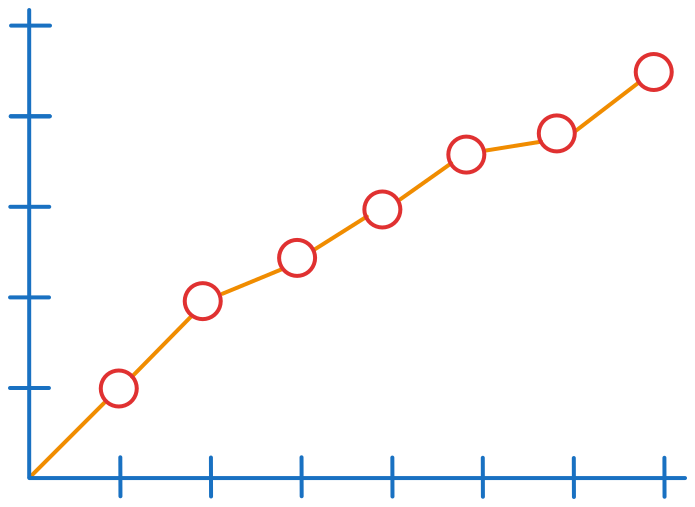
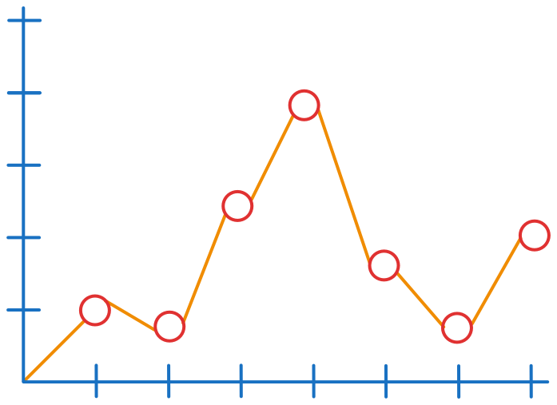
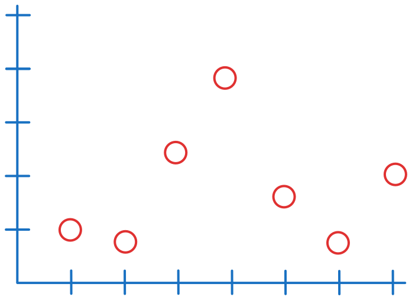
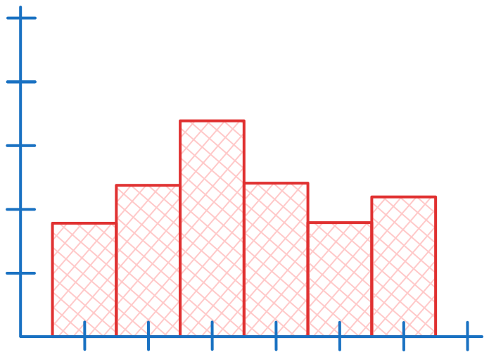
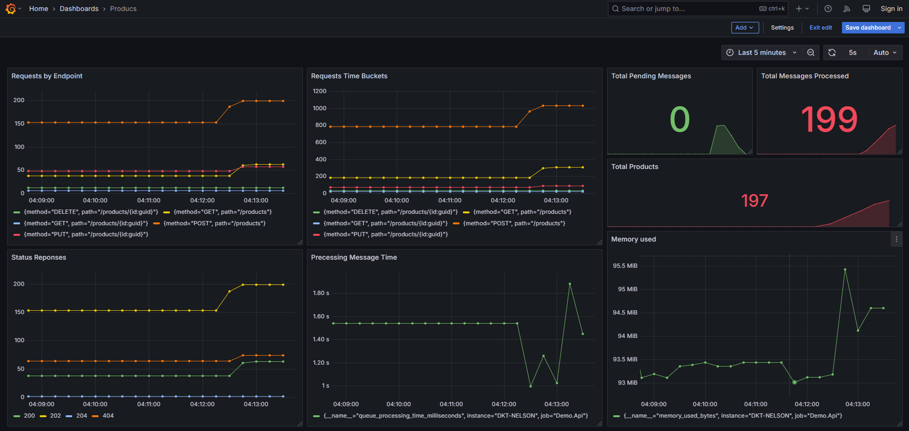

# Observability - Custom Metrics in .NET

## .NET Metrics API

.NET supports four types of metrics: `Counter`, `UpDownCounter`, `Gauge` and `Histogram`. It provides two approaches for updating metrics: `Direct` and `Observer`.


### Counter

A `Counter` is a cumulative metric type that represents a monotonically increasing value that can only increase.

#### When to use

* Number of requests processed
* Number of errors occurred
* Number of payments processed

#### Direct Approach

```csharp
using System.Collections.Generic;
using System.Diagnostics.Metrics;

var meter = new Meter("App");
var requestCounter = meter.CreateCounter<int>("http_requests");

requestCounter.Add(1);
```

#### Observer Approach

```csharp
using System.Collections.Generic;
using System.Diagnostics.Metrics;

var meter = new Meter("App");

var messageProcessedCounter = 0;

meter.CreateObservableCounter<int>(
    name: "messages_processed",
    observeValue: () => messageProcessedCounter,
    unit: "items",
    description: "Total number of messages processed by the queue");

Interlocked.Increment(ref messageProcessedCounter);
```




### UpDownCounter

An `UpDownCounter` is similar to a `Counter`, but it allows both increments and decrements. This makes it useful for tracking values that can fluctuate over time. The next value always depends on the previous value.

#### When to use

* Number of online users
* Number of items in a queue
* Number of active threads

#### Direct Approach

```csharp
using System.Collections.Generic;
using System.Diagnostics.Metrics;

var meter = new Meter("App");
var numberOfUsers = meter.CreateUpDownCounter<int>("number_users");

numberOfUsers.Add(1);
numberOfUsers.Add(-1);
```

#### Observer Approach

```csharp
using System.Collections.Generic;
using System.Diagnostics.Metrics;

var meter = new Meter("App");

var queuePendingItems = 0;

meter.CreateObservableUpDownCounter(
    name: "queue_pending",
    observeValue: () => queuePendingItems,
    unit: "items",
    description: "Number of items in the queue");

Interlocked.Increment(ref queuePendingItems);
Interlocked.Decrement(ref queuePendingItems);
```




### Gauge

A `Gauge` is a metric that represents a single numerical value that can arbitrarily go up and down. A `Gauge` represents a snapshot of the current value. Each recorded value is independent and does not depend on the previous one.

#### When to use

* Memory usage
* CPU usage
* Temperature

#### Direct Approach

```csharp
using System.Diagnostics;
using System.Diagnostics.Metrics;

var meter = new Meter("App");
var queueProcessingTime = meter.CreateGauge<double>(
    "queue_processing_time",
    unit: "ms",
    description: "Average processing time of items in the queue");

var stopwatch = Stopwatch.StartNew();

// Operation

stopwatch.Stop();
queueProcessingTime.Record(stopwatch.ElapsedMilliseconds);
```

#### Observer Approach

```csharp
using System.Diagnostics;
using System.Diagnostics.Metrics;

var meter = new Meter("App");
meter.CreateObservableGauge(
    name: "memory_used",
    observeValue: () =>
    {
        using var process = Process.GetCurrentProcess();
        return process.WorkingSet64;
    },
    unit: "bytes",
    description: "Amount of memory used by the current process in bytes");
```




### Histogram

The `Histogram` measures the distribution of values over time. It groups values into predefined buckets and counts how many values fall into each range.

**Example:**

Imagine the following the request times in milliseconds. `[ 9, 24, 47, 75, 113, 421, 591, 891, 912, 1050, 1120, 1300, 1771, 1881, 5991 ]`

And the buckets: `[ 10, 50, 100, 200, 500, 1000, 5000 ]`

| Bucket  | Count | Description |
|---------|-------|-------------|
| <= 10   | 1     | Ultra fast  |
| <= 50   | 3     | Fast        |
| <= 100  | 4     | Normal      |
| <= 200  | 5     | Slow        |
| <= 500  | 6     | Very slow   |
| <= 1000 | 9     | Ultra slow  |
| <= 5000 | 14    | Hyper slow  |
| < +Inf  | 15    | Outlier     |

Basically, the `Histogram` determines the appropriate bucket for each value and increases its count. The buckets are sorted in ascending order, with the last bucket always being `+Inf`. When a value is recorded, all applicable buckets (i.e., those greater than or equal to the value) are incremented.

With this, you can measure how many requests fall below a certain threshold.

#### When to use

* Request duration patterns
* Distribution of a payload size
* Distribution of CPU usage

#### Direct Approach

```csharp
using System.Diagnostics;
using System.Diagnostics.Metrics;

var meter = new Meter("App");
var requestDuration = meter.CreateHistogram<double>(
    name: "request_duration",
    unit: "ms",
    description: "Duration of HTTP requests in milliseconds");

requestDuration.Record(100);
requestDuration.Record(200);

....

builder.Services
    .AddOpenTelemetry()
    .ConfigureResource(...)
    .WithMetrics(options => options
        .AddView(
            "request_duration",
            new ExplicitBucketHistogramConfiguration { Boundaries = [10, 50, 100, 200, 500, 1000, 5000] }));
```




## Tags The Importance of Tags in Metrics

**Tags** (or **Labels** in Prometheus) are **additional dimensions** that can be attached to a metric to segment the data and gain more granular insights.

Instead of having **a single global metric**, we can **filter it by different categories**, such as:
- **HTTP Method (`GET`, `POST`, `DELETE`)**
- **Request Status (`200`, `400`, `500`)**
- **Service Name**
- **Datacenter Region**
- **User Type (`free`, `premium`)**

> **Without tags, we only know the total value. With tags, we can analyze each dimension separately!**

### Why Use Tags in Metrics?
- **Enable segmentation and filtering of data** → Example: Instead of just measuring the total number of requests, we can see **how many were `GET` vs. `POST`**;
- **Help analyze issues and trends** → Example: We can check **if an increase in response time only happens in a specific region (e.g., `us-east-1`)**;
- **Reduce the need to create multiple separate metrics** → Instead of creating `http_requests_get`, `http_requests_post`, `http_requests_delete`, we can **use a single `http_requests_total` metric and filter by `method="GET"`**.

### Example:


```csharp
using System.Collections.Generic;
using System.Diagnostics.Metrics;

var meter = new Meter("App");
var requestCounter = meter.CreateCounter<int>("http_requests");

requestCounter.Add(
    1,
    KeyValuePair.Create<string, object?>("method", "GET"),
    KeyValuePair.Create<string, object?>("status", "200"));
```

#### Output in Prometheus
Prometheus stores data with **labels (tags)** to allow detailed queries.

```plaintext
# TYPE http_requests_total counter
http_requests_total{method="GET", status="200"} 150
http_requests_total{method="POST", status="500"} 30
http_requests_total{method="DELETE", status="404"} 5
```
**Now we can query detailed metrics!**
- `http_requests_total{method="GET"}` → Total number of `GET` requests.
- `http_requests_total{status="500"}` → Total number of failed requests (`500`).


## Tools

### Prometheus

From Prometheus' perspective, there are four types of metrics: `Counter`, `Gauge`, `Histogram`, and `Summary`. However, we will focus only on the .NET perspective and how it relates to Prometheus.

We will mention specific details only when discussing how metrics are passed from .NET to Prometheus.

To enable the OTLP receiver, you need to configure both the Prometheus receiver and the OTLP exporter in your .NET application.

[Prometheus OTLP receiver Docs](https://prometheus.io/docs/guides/opentelemetry/)


#### Counter from .NET to Prometheus

When a `Counter` is used in .NET, it is translated into a `Counter` in Prometheus. The Prometheus exporter automatically appends the `_total` suffix to the metric name.


**For example:**

```csharp
Meter.CreateCounter<int>("http_requests");
```

```text
http_requests_total
```


#### UpDownCounter from .NET to Prometheus

When we use the `UpDownCounter` in .NET, it is translated into a `Gauge` in Prometheus because it can both increase and decrease, which aligns with the behavior of a Gauge.


#### Gauge from .NET to Prometheus

When a `Gauge` is used in .NET, it is translated into a `Gauge` in Prometheus. If a unit is specified in .NET, Prometheus appends it as a suffix to the metric name.

**For example:**

```csharp
Meter.CreateGauge<int>(
    name: "temperature",
    unit: "celsius");
```

```text
temperature_celsius
```


## Examples



